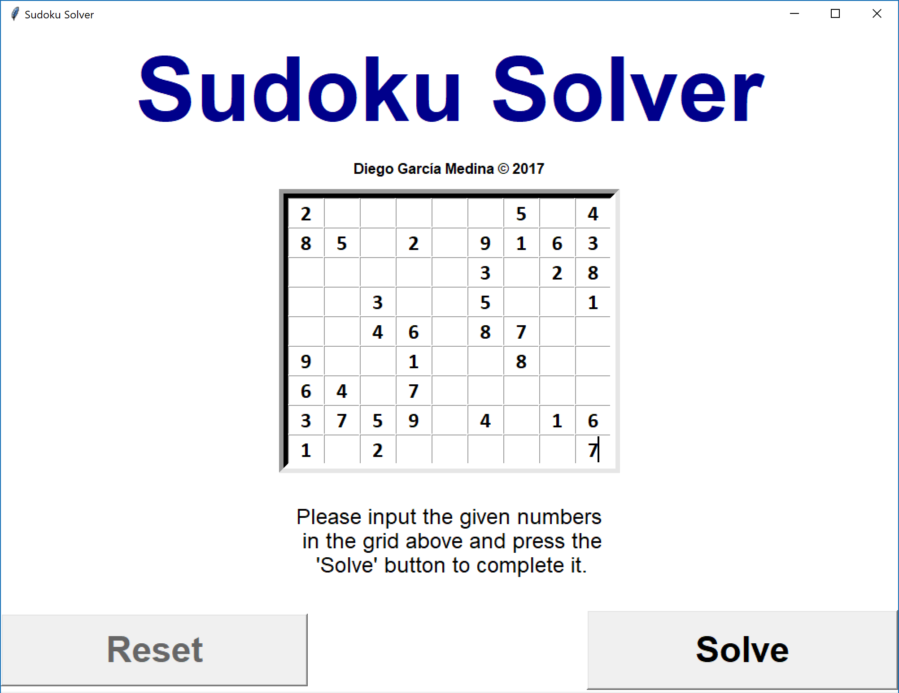

# Sudoku-Solver

Here is a personal project that attempts to solve one of the most popular games known: Sudoku

The repository has the example program **Sudoku Solver example.py**, which solves the SUDOKU without the GUI (from pre-definied NumPy arrays acting as the grid).

On the other hand there is the full program **GUI Sudoku.py** The implementation shown required Tkinter in order to produce the GUI.

How to open the Sudoku Solver:

1. Clone the repo.
2. Open the .exe file in "SUDOKU SOLVER/dist/GUI Sudoku/GUI Sudoku.exe"

Instructions on how to use the GUI:

1. Type in the numbers into the correct position of the grid.

	

2. Press the button START to solve the program.

	

3. Once you are happy with the result, press the RESET button to clear the grid.