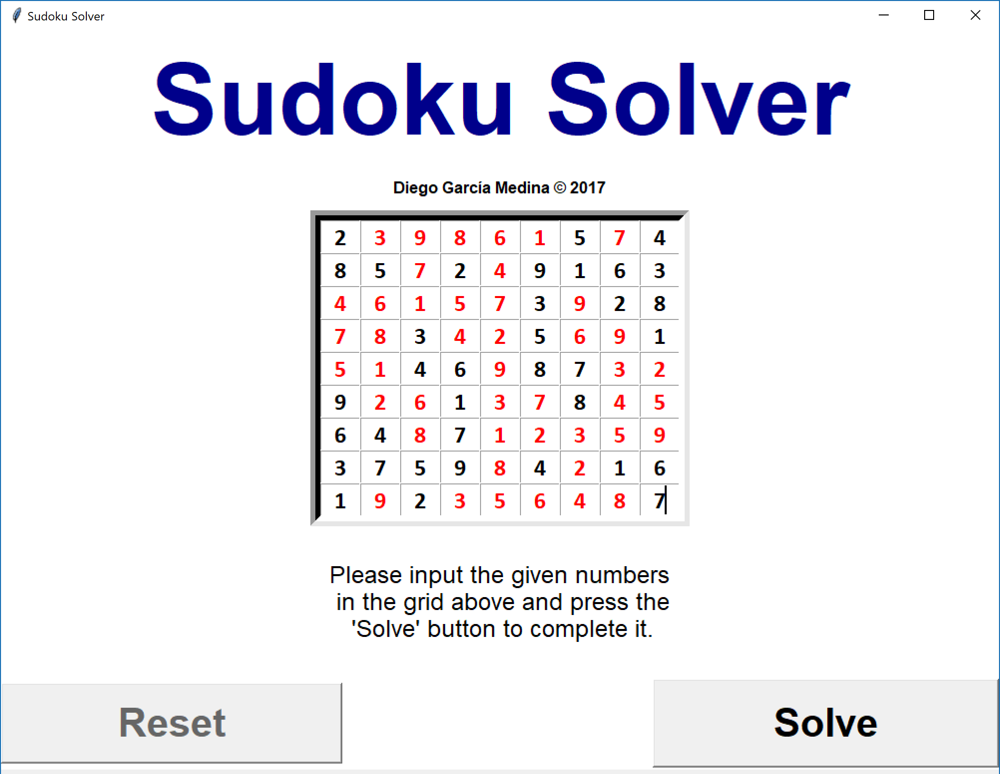

# Sudoku-Solver

Here is a personal project that attempts to solve one of the most popular games known: Sudoku

The repository has the core algorithm program **Sudoku_Solver_algorithm.py** that can be used as an example, which solves the SUDOKU without the GUI (from pre-definied NumPy arrays acting as the grid) and returns the number of iterations required to solve the puzzle.

On the other hand there is the full program **Sudoku_Solver_with_GUI.py** The implementation shown required Tkinter in order to produce the GUI.

In order to start the program with GUI, simply run the Sudoku_Solver_with_GUI.py making sure that the Sudoku_Solver_algorithm.py is in the same folder.

Instructions on how to use the GUI:

1. Type in the numbers into the correct position of the grid.

	

2. Press the button START to solve the program.

	

3. Once you are happy with the result, press the RESET button to clear the grid.